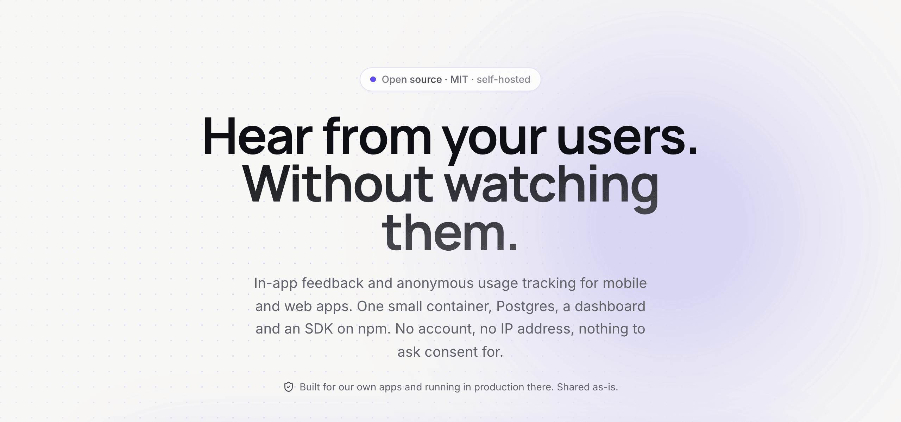
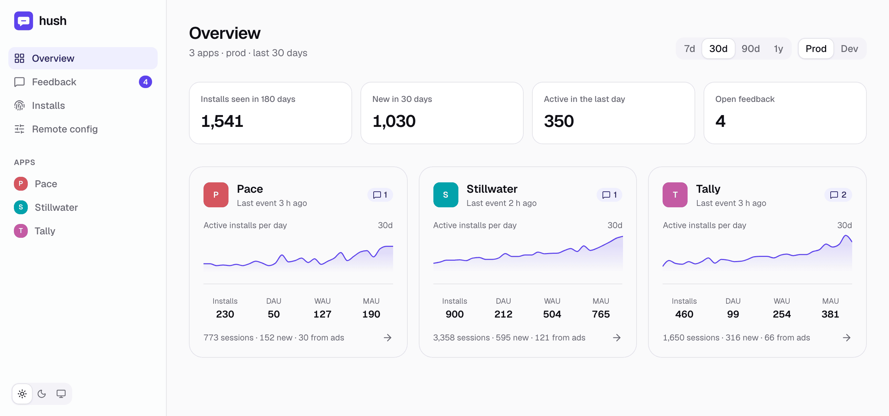
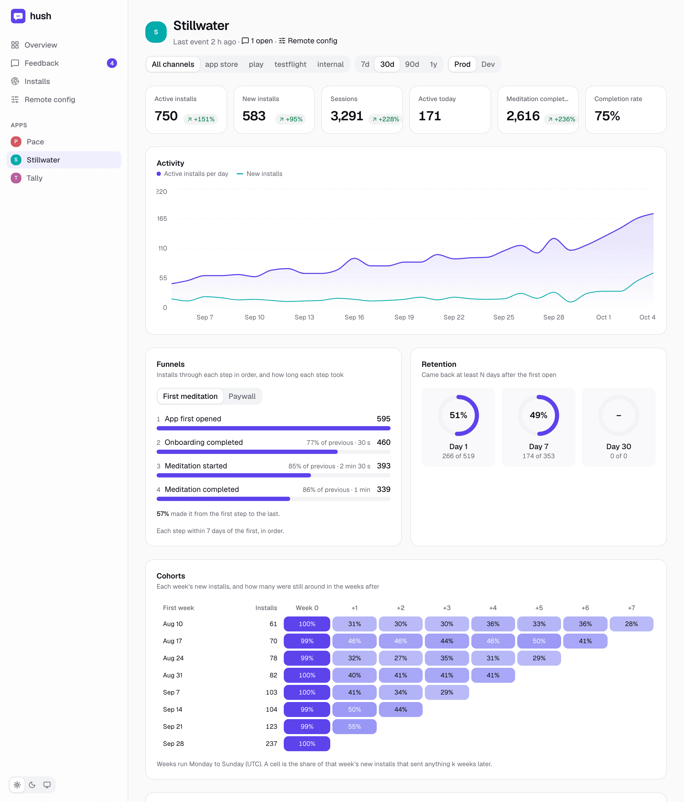
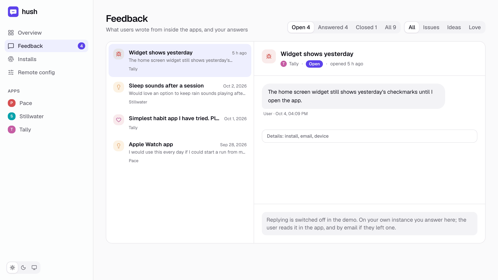
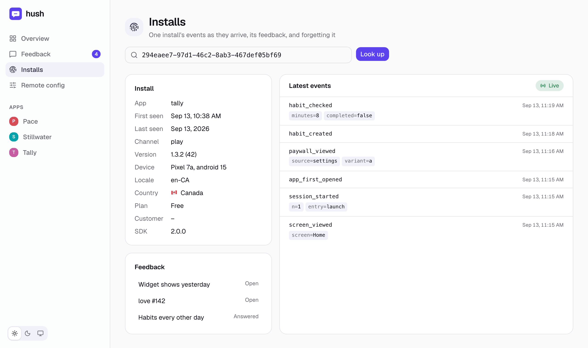
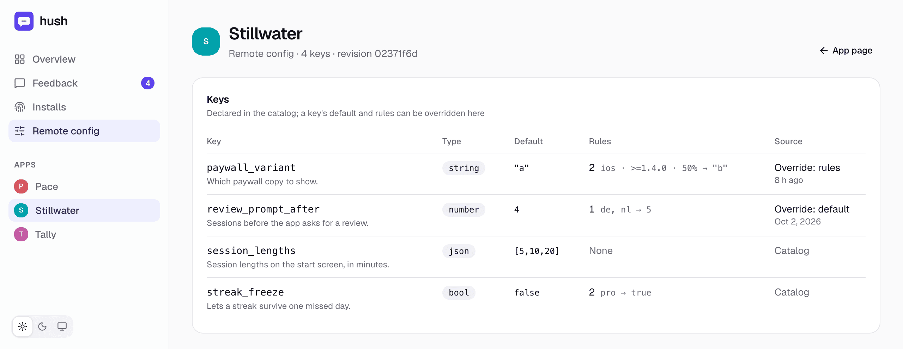

# hush

<p align="center">
<picture>
  <source media="(prefers-color-scheme: dark)" srcset="docs/img/hero-dark.png">
  
</picture>
</p>

<p align="center">
  <a href="https://hush.bavrk.com/demo/dashboard/"><b>Live demo</b></a> ·
  <a href="https://hush.bavrk.com">Site and docs</a> ·
  <a href="#run-the-server">Run the server</a> ·
  <a href="sdk/README.md">SDK guide</a>
</p>

[](https://www.npmjs.com/package/@bavrk/hush)
[](https://www.npmjs.com/package/@bavrk/hush-expo)
[](https://www.npmjs.com/package/@bavrk/hush-capacitor)
[](https://github.com/enso-works/hush/actions/workflows/test.yml)
[](LICENSE)

In-app feedback and anonymous usage tracking for mobile and web apps: one small
Node container, Postgres, a dashboard, and an SDK on npm (`@bavrk/hush`) for
Expo, React Native, the web and Capacitor, with optional native iOS
companions for Expo (`@bavrk/hush-expo`) and Capacitor
(`@bavrk/hush-capacitor`).

Built for our own apps ([bavrk](https://bavrk.com): Braele and friends), where
it runs in production. It is public so you can read it, fork it or run it
yourself; it is not a product, and there is no support beyond what the code
and this page say. MIT.

- **Feedback**: users write from inside the app (a problem, an idea, or kind
  words). You answer on the dashboard, and by email if they left an address;
  they read your reply in the app and can answer back.
- **Anonymous tracking**: installs, numbered sessions and their time in the
  app, screens, a paywall funnel, retention, versions, build channels (so
  TestFlight stays out of the store numbers), and your own events with props,
  broken down by any prop. No account, no advertising id, no IP address, so
  nothing to ask consent for.
- **Remote config**: values the app reads at runtime (a flag, a kill switch,
  a number, copy), declared in the catalog and changed on the dashboard
  without a release, with targeting and rollouts worked out on the device.
- **Revenue** (optional): RevenueCat's own figures next to your usage.

Site and docs: [hush.bavrk.com](https://hush.bavrk.com). See the dashboard on
invented data: [live demo](https://hush.bavrk.com/demo/dashboard/).

## The dashboard

Every app at a glance: installs, daily, weekly and monthly actives, open
feedback.

<picture>
  <source media="(prefers-color-scheme: dark)" srcset="docs/img/overview-dark.png">
  
</picture>

One app: activity, your own events, funnels, retention and weekly cohorts,
by channel and period.

<picture>
  <source media="(prefers-color-scheme: dark)" srcset="docs/img/app-dark.png">
  
</picture>

Feedback threads from inside the apps, answered here.

<picture>
  <source media="(prefers-color-scheme: dark)" srcset="docs/img/feedback-dark.png">
  
</picture>

One install's events as they arrive, and its feedback. Forgetting an install
starts here.

<picture>
  <source media="(prefers-color-scheme: dark)" srcset="docs/img/installs-dark.png">
  
</picture>

Remote config: the catalog's keys, with overrides and rules changed without a
release.

<picture>
  <source media="(prefers-color-scheme: dark)" srcset="docs/img/config-dark.png">
  
</picture>

The images come from the live demo; `npm run shots` in `dashboard/` takes
them again.

## Packages

| Package | What it is for |
|---|---|
| [`@bavrk/hush`](https://www.npmjs.com/package/@bavrk/hush) | The SDK. `@bavrk/hush` for Expo and React Native, `@bavrk/hush/web` for web pages, PWAs and Capacitor, `@bavrk/hush/core` for any other JavaScript runtime. [Guide](sdk/README.md) |
| [`@bavrk/hush-expo`](https://www.npmjs.com/package/@bavrk/hush-expo) | Optional, iOS, Expo development builds: Apple ad attribution, the TestFlight or App Store channel, background time for the last send. A no-op on Android, the web and in Expo Go. [Guide](expo/README.md) |
| [`@bavrk/hush-capacitor`](https://www.npmjs.com/package/@bavrk/hush-capacitor) | Optional, iOS, Capacitor apps: the same as `@bavrk/hush-expo`, for `@bavrk/hush/web` in a Capacitor app. A no-op on Android and the web. [Guide](capacitor/README.md) |
| server (this repo, not on npm) | One Node 22 container with the dashboard, plus Postgres. [Run it](#run-the-server) with `docker compose` from `examples/`. |

## Install the SDK

```sh
# Expo (works in Expo Go, no native build)
npx expo install @bavrk/hush @react-native-async-storage/async-storage expo-constants expo-device expo-localization

# Bare React Native (0.73+): the SDK reads version, device and locale through Expo modules
npx install-expo-modules@latest
npx expo install @bavrk/hush @react-native-async-storage/async-storage expo-constants expo-device expo-localization
npx pod-install                       # then rebuild the app

# Web, PWA or Capacitor: no peers; import createWebHush from '@bavrk/hush/web'
npm install @bavrk/hush

# Optional, iOS: ad attribution and the TestFlight channel; needs a development build
npx expo install @bavrk/hush-expo

# Optional, iOS, Capacitor: the same, for @bavrk/hush/web; then a new native build
npm i @bavrk/hush @bavrk/hush-capacitor && npx cap sync ios
```

`@bavrk/hush-expo` needs an iOS deployment target of 16.4: the default on Expo
SDK 56, set with `expo-build-properties` on 52-55 ([guide](expo/README.md)).
In bare React Native it needs Expo SDK 52 or later (React Native 0.76+): set
`platform :ios, '16.4'` in the Podfile, and write its two Info.plist keys by
hand. `@bavrk/hush-capacitor` needs iOS 15, Capacitor 8's default, and its
two Info.plist keys written by hand ([guide](capacitor/README.md)).

Then, once, as the app starts:

```ts
import * as hush from '@bavrk/hush';

hush.configure({
  url: 'https://hush.example.com',
  key: __DEV__ ? (process.env.EXPO_PUBLIC_HUSH_KEY ?? '') : 'hush_myapp_prod_…', // release builds: the prod key in code
  channel: process.env.EXPO_PUBLIC_HUSH_CHANNEL, // per EAS profile: app_store, play, internal; `dev` in __DEV__
});
hush.init();                   // at startup; never throws
hush.identify({ pro: isPro }); // isPro: your paid state, whenever you learn it
```

Elsewhere in the app:

```ts
hush.track('onboarding_completed', {}, { once: true }); // when onboarding ends; at most once per install

async function onSendFeedback(message: string) {
  const r = await hush.createTicket({ kind: 'issue', message });
  // r.ok, or r.error: 'offline' | 'too_many' | 'failed' | 'unavailable'
}
```

One production build goes to TestFlight and then to the App Store, so an EAS
profile cannot tell those two apart. On iOS,
`hushExpo.channel() ?? process.env.EXPO_PUBLIC_HUSH_CHANNEL` from
`@bavrk/hush-expo` does, and keeps TestFlight out of the store numbers; in a
Capacitor app, `(await hushCapacitor.channel()) ?? fallback` from
`@bavrk/hush-capacitor`.

`entry('link', { url })` says how a session began; call it as soon as the
app has the link, before or after `init()` resolves. (SDK 2.2.1 and older
need `init()` called right after `configure()`, `entry()` only after `init()`
has resolved, and `identify()` early: see the SDK guide.) The
[SDK guide](sdk/README.md) has the rest: screens, link tags, opt-out and
`forget()`, the naming limits, remote config and the web entry.

## Run the server

```bash
git clone https://github.com/enso-works/hush && cd hush/examples
cp .env.example .env            # set ADMIN_TOKEN and POSTGRES_PASSWORD
docker compose up -d            # http://localhost:3000

docker compose exec hush node src/cli.mjs apps:add myapp "My App"
docker compose exec hush node src/cli.mjs keys:create myapp prod   # prints the write key once
docker compose exec hush node src/cli.mjs keys:create myapp dev
```

Dashboard: `http://localhost:3000/dashboard/`, signed in with `ADMIN_TOKEN`.

Before pointing real apps at it: put it behind a TLS proxy, expose only
`/v1/*`, `/healthz` and, for ad attribution, the two
`/.well-known/.../report-attribution/` paths (below) publicly, keep
`/dashboard/` and `/admin/*` behind a VPN or an access proxy (the token is
the second lock, not the only one), and back up Postgres; it is the only
state. A proxy on a private network may also sign the dashboard in for its
users, by adding `Authorization: Bearer <ADMIN_TOKEN>` or
`ADMIN_PROXY_HEADER: <ADMIN_PROXY_SECRET>` to `/admin/*`: the dashboard then
opens without a sign-in, and admin writes stay safe because the server
accepts only same-origin JSON for them.

## With an AI coding agent

The [hush plugin](plugins/hush/) for Claude Code:

```
/plugin marketplace add enso-works/hush
/plugin install hush@hush
```

`hush:installer` wires hush into an app (`/hush:install` starts it),
`hush:tracking-planner` designs its events, funnels and catalog, and the
`hush` skill answers usage questions. For Cursor, Codex and other agents,
`npx skills add enso-works/hush` installs the skill.

## What is collected

- **An install id**: a random UUID the app creates on first launch. Deleting
  the app deletes it. It is the only identifier hush creates.
- **A paid flag**, unknown until the app calls `identify({ pro })` (a new
  install is stored as unpaid; SDK 2.2.1 and older send `false` until then).
- **RevenueCat's customer id**, only if the app calls `identify({ rcId })`:
  pass RevenueCat's anonymous id, not your own account ids. Every batch also
  carries the build channel and the SDK version.
- **The app version and build, OS, device model, the phone's language**, and
  the events and props your app sends. Keep props to what the app did, not
  who did it.
- **Country**, only if you set `COUNTRY_HEADER` behind a proxy that provides a
  trusted one. The dashboard folds any country under ten installs into
  "other".
- **An email address**, only when a user types one into feedback. That
  ticket is kept apart from the install ([below](#what-a-ticket-carries)).
- **No IP address**, anywhere. Rate limits count a salted hash that lives in
  memory only.
- **No advertising or device identifiers**: nothing for App Tracking
  Transparency to ask about. From a link, only its `utm_*` and `ref` tags.
- **Nothing for remote config**: its request carries the write key and a
  revision, and the device never reports which value it got. Like any
  request it arrives with the device's IP address and the platform's
  User-Agent; hush keeps neither, but a TLS proxy's access log may
  ([below](#remote-config)).

Raw events are deleted after `RETENTION_DAYS` (180). An install that has
sent nothing for `INSTALL_RETENTION_DAYS` (`RETENTION_DAYS` unless set)
loses its row too. With that window at least as long as `RETENTION_DAYS`,
as by default, its events are gone by then: nothing about how it used the
app is left. A shorter one deletes the row and leaves its events until they
age out, and the server warns at boot. So, with the defaults, a privacy
policy can say that everything about an install's use of the app is
deleted from the live database 180 days after it last sends anything, and
from backups as they expire: name how long yours are kept, if you keep any.
Feedback threads are kept until they are forgotten, so a policy names them
apart: a thread without an email keeps the install id when the row goes, so
it can still be answered, and the app lists it again if the install comes
back. They are forgotten with the SDK's `forget()`, the dashboard's Installs
page, or Delete on one ticket. `forget()` reaches the install's own tickets
and the tickets sent with an email whose keys are on the device. It cannot
reach a ticket sent with an email by an app before SDK 2.3.0 once that
ticket is unlinked ([below](#what-a-ticket-carries)), nor one whose key went
with a reinstall: the operator deletes those with Delete, on request. So the
app's "delete my data" text should give the support address for messages
sent with an email. The write key ships inside the app, so it is not a
secret: it identifies the app, can be revoked, and can read nothing but the
calling install's own feedback, or a ticket whose key the caller holds.

### What a ticket carries

An email is contact info. From SDK 2.3.0 a ticket that carries one never
carries the install id or RevenueCat's id: hush stores no id or key that
joins it to an install, and the dashboard offers no way to do it. The app
reaches that ticket with a key of its own, which the server keeps only as a
hash. A ticket without an email carries the install id, because the app is
the only way the answer gets back, and nothing that says who wrote it.

| | Without an email | With an email (SDK 2.3.0 and later) |
|---|---|---|
| Message, kind, subject | yes | yes |
| App version, build, OS, device model, paid flag | yes | yes |
| Install id | yes | no: a thread key for that ticket instead |
| RevenueCat's customer id | when the app has passed one | no |
| Email | no | yes |
| `ticket_opened` and `ticket_replied` events | yes | no |
| When the app last fetched it | yes | no: only which reply it has shown |

The SDK also keeps the install id out of every URL from 2.3.0
(`POST /v1/tickets/list`), so a proxy's access log cannot pair it with a
reply on a ticket sent with an email from the same address.

What no id can hide: the ticket's time, and diagnostics that the install's
row and events also hold. On an app with few users, someone with access to
the database could narrow a ticket down to one install by those, as they
could match any two records by time. hush does not do that, and an app must
not try: Apple counts data as not linked only while nobody tries to link it
back. Do not make it easier: leave the feedback and inbox screens out of
`screen()` (or report them under a name other screens share), list them in
the catalog's `private_screens`, and put nothing about a ticket in an event.
The server stores no view of a screen in `private_screens`, or of a screen
under one (`support` covers `support/new` and `support/42`), whichever build
sends it, and deletes the views stored before the catalog named it; backups
taken before then keep them until they expire. That matters for app versions
that named a screen by its URL, which put the ticket id in it
([dogfood log](docs/dogfood.md)).

App versions built with SDK 2.2.x or older still send the install id and
RevenueCat's id with an email, and track `ticket_opened` and `ticket_replied`
with the install. The server drops RevenueCat's id when the ticket arrives.
It keeps the install id only so that the app's inbox can list the ticket,
and clears it once the ticket is closed and the app has fetched it since (or
7 days after it closed), or 30 days after the last activity on it. That
install's `ticket_opened` and `ticket_replied` events since the ticket was
opened are deleted with it. Until then that ticket is linked to that
install, so the answers above hold in full only for builds on 2.3.0 or
later. The dashboard never shows an install on a ticket with an email, and
an install's page never lists one.

### App Privacy answers

What an app on hush and `@bavrk/hush-expo` or `@bavrk/hush-capacitor` can
declare in App Store Connect's App Privacy section. Every row is Tracking:
No. A row applies when its "When" does; an app that collects none of it
leaves the row out.

| Data type | When | Linked to the user | Purposes |
|---|---|---|---|
| Usage Data: Product Interaction | Always: events, sessions, screens | No | Analytics; Developer's Advertising or Marketing when hush-expo or hush-capacitor reports conversion values |
| Usage Data: Other Usage Data | When the app sends an answer about its use as a prop, such as where the user heard of the app | No | Analytics |
| Usage Data: Advertising Data | With hush-expo's or hush-capacitor's ad attribution: hush stores Apple's postback copies | No | Developer's Advertising or Marketing; Analytics |
| Purchases: Purchase History | When the app sends purchase events (`purchase_started`, `purchase_result`, `restore_result`) | No | Analytics; Developer's Advertising or Marketing when a conversion value marks a purchase |
| Diagnostics: Other Diagnostic Data | Always: app version, build, OS, device model, language, channel, paid flag | No | Analytics |
| Location: Coarse Location | When the server sets `COUNTRY_HEADER` | No | Analytics |
| Contact Info: Email Address | When the feedback form asks for one | Yes, only for people who write in with an email | App Functionality |
| User Content: Customer Support | When the app takes feedback | Yes, only for people who write in with an email; No without an email field | App Functionality |

These hold for builds on SDK 2.3.0 or later against a server with migration
008 (`private_screens`; an older server ignores the key), with the feedback
and inbox screens out of `screen()` and in `private_screens`, and nothing
about a ticket in an event
([above](#what-a-ticket-carries)). Other SDKs in the app answer for
themselves, in the same rows: RevenueCat adds App Functionality to Purchase
History. Braele's answers, which this table follows, have no Identifiers
row for the install id or RevenueCat's anonymous id. Remote config adds no
row and changes none: it collects nothing.

## Configuration

Only `DATABASE_URL` and `ADMIN_TOKEN` are required.

| Variable | |
|---|---|
| `DATABASE_URL` | Postgres. Migrations run at every boot, before listening. |
| `ADMIN_TOKEN` | Guards `/admin/*` and the dashboard's data. `openssl rand -hex 32`. The old name `TELEMETRY_ADMIN_TOKEN` still works. |
| `ADMIN_PROXY_HEADER`, `ADMIN_PROXY_SECRET` | A header a trusted proxy sets, and its secret (16+ characters), accepted on `/admin/*` instead of the token. Only when the proxy overwrites that header. |
| `APPS` | Register apps at boot: `myapp=My App,other=Other`. |
| `CATALOG_FILE` | Each app's known events, highlight metric, funnels and remote config keys, as JSON (below). |
| `CLIENT_IP_HEADER` | Header a trusted proxy sets with the caller's address (`cf-connecting-ip`, `x-forwarded-for`), for rate limits. Unset: the socket address. Behind a proxy, set it: otherwise every caller has the proxy's address and shares its limits, and an app takes five tickets with an email a day from all its users together. The server warns once when a request comes from a private address and it is unset. |
| `COUNTRY_HEADER` | Header a trusted proxy sets with a two-letter country (`cf-ipcountry`). Unset: no country. |
| `RESEND_API_KEY`, `MAIL_FROM` | Email through [Resend](https://resend.com): feedback alerts, and your replies to users who left an address. |
| `ALERT_EMAIL`, `REPLY_HINT` | Where new feedback is announced (at most 30 an hour), and a last line saying where to answer. |
| `RETENTION_DAYS` | Raw events are deleted after this many days. Default 180. |
| `INSTALL_RETENTION_DAYS` | An install's row is deleted once it has sent nothing for this many days: no batch, and no event dated inside the window. Default `RETENTION_DAYS`, when its events are gone too; 0 keeps every row. Shorter than `RETENTION_DAYS`, the row goes while its events stay, and an install that sends again before they go counts as new; the server warns at boot. Its tickets keep the install id. The dashboard's install total and Countries panel then count the installs seen in that window, not all time. New installs and retention count only the installs first seen inside the window, so a longer period (the 1y view) is cut to it and says so: an older install is on record only if it kept sending, and counting it would push the retention rate up. An install that sends again after its row went counts as new. |
| `RC_API_KEY`, `RC_PROJECTS`, `RC_CURRENCY` | RevenueCat v2 secret key with read-only scopes; see `src/revenuecat.mjs`. `RC_STALE_MINUTES` (10), `RC_FLOOR_SECONDS` (60) and `RC_RATE_PER_MINUTE` (20) pace its refreshes. |
| `ASC_KEY_ID`, `ASC_ISSUER_ID`, `ASC_PRIVATE_KEY` (or `_FILE`) | An App Store Connect API key, for campaign reports (below). The Admin role once, to create each app's report request; Sales and Reports after. `ASC_API_BASE` changes Apple's address, for tests. |
| `DEMO` | `1`: a public read-only showcase with invented data. It wipes its database daily, so give it one of its own; it refuses a database with write keys. |
| `PORT`, `MAIL_DRY_RUN` | `3000`; `1` logs mail instead of sending it. |

`examples/docker-compose.yml` passes the rest of these through, except `PORT`
(the container listens on 3000; `HUSH_PORT` picks the host port) and
`DATABASE_URL`, which it builds from `POSTGRES_PASSWORD` for its own
Postgres. `CATALOG_FILE` is a host path it mounts. It wants `ADMIN_TOKEN`
under that name, not the old one.

The catalog names the events you expect (anything else is still stored,
flagged as unknown on the dashboard), one highlight (the event counted per
period, and the prop that marks it done), and the funnels the dashboard
shows. A funnel is ordered: each step must follow the one before, within
`window_days` (default 7) of the first; a step can match props with `where`.
Without funnels an app gets a paywall one; any funnel can also be built on
the dashboard without touching the catalog. `breakdowns` pin charts to the
app's page: one event split by one prop, counted per event or, for an answer
that can change later, once per install. `app_store_id` and
`conversion_values` are for where installs come from (below); postbacks are
matched to an app by `app_store_id` alone, so attribution needs it.
`private_screens` lists screens, as the app names them in `screen()`, that
the server never stores: a `screen_viewed` naming one, or a screen under one
(`support/42` under `support`), in any prop is accepted and discarded, any
other event loses a prop that names one, and views stored before are
deleted at boot and in the six-hourly sweep. List the feedback and inbox
screens there. `config` declares the app's remote config keys, each with a
type, a default, a description and optional rules
([below](#remote-config)). The catalog is read once at boot and a mistake in it stops
the boot, naming the path: restart after editing it. A key the server does
not read, misspelt or from a later version, is ignored with a warning in
the log. Leave out `funnels` rather than writing `[]`.

```json
{
  "myapp": {
    "events": ["onboarding_completed", "workout_started", "workout_completed"],
    "highlight": { "event": "workout_completed", "done_prop": "completed" },
    "funnels": [
      { "name": "First workout", "steps": ["app_first_opened", "onboarding_completed", "workout_completed"] },
      { "name": "Paywall", "window_days": 3, "steps": ["paywall_viewed", "purchase_started",
        { "event": "purchase_result", "where": { "result": "purchased" }, "label": "Purchased" }] }
    ],
    "breakdowns": [
      { "event": "workout_completed", "prop": "kind", "title": "Workouts by kind" },
      { "event": "onboarding_completed", "prop": "goal", "count": "installs" }
    ],
    "private_screens": ["support", "feedback"],
    "app_store_id": "1234567890",
    "conversion_values": [
      { "value": 1, "coarse": "low", "event": "onboarding_completed", "label": "Onboarded" },
      { "value": 8, "coarse": "medium", "event": "workout_completed", "label": "First workout" },
      { "value": 63, "coarse": "high", "event": "purchase_result", "where": { "result": "purchased" }, "label": "Purchased", "lock": true }
    ],
    "config": {
      "review_prompt_after": { "type": "number", "default": 3, "description": "Sessions before the app asks for a review." }
    }
  }
}
```

## Where installs come from

Three ways, all counted in aggregate: nothing here fingerprints anyone,
reads an advertising id, or needs an App Tracking Transparency prompt.

- **Link tags.** A link with `utm_*` tags passed to `entry('link', { url })`
  tags the session. The Campaigns panel counts each install once, for its
  first tagged session, split by source, campaign, ad set (`utm_term`) or ad
  (`utm_content`), through any funnel. On iOS a link only opens an app
  already installed. For a Meta ad: `utm_source=meta&utm_medium=paid_social&utm_campaign={{campaign.name}}&utm_term={{adset.name}}&utm_content={{ad.name}}`.
- **App Store campaigns.** App Store Connect counts views, first downloads,
  sessions and proceeds per campaign link (`apps.apple.com/app/id…?pt=…&ct=…`).
  With `ASC_*` set and the app's `app_store_id` in the catalog, hush imports
  those reports every six hours (`node src/cli.mjs asc:request <app>` once,
  `asc:sync` by hand). Apple hides anything under five users and adds noise.
- **Ad attribution (SKAdNetwork, AdAttributionKit).** Apple tells the ad
  network which campaign won an install, with a conversion value the app
  sets through [`@bavrk/hush-expo`](expo/README.md) or
  [`@bavrk/hush-capacitor`](capacitor/README.md) as the catalog's
  `conversion_values` happen. iOS sends hush a copy of each postback: serve
  `/.well-known/skadnetwork/report-attribution/` and
  `/.well-known/appattribution/report-attribution/` on the registrable domain
  the app names. hush verifies Apple's signature and counts only what
  verifies; test postbacks show under dev. Enter the same milestone table in
  the ad network (Meta: Events Manager).

## Remote config

Values the app reads at runtime and you change without a release: a feature
flag, a kill switch, a number, copy per language. Values and targeting only:
no experiments, no exposure events, no variant statistics.

Each key is declared in the app's catalog entry, in git, with a type
(`bool`, `number`, `string` or `json`), a default, a description and
optional rules. A whole catalog with one app:

```json
{
  "myapp": {
    "events": ["onboarding_completed"],
    "config": {
      "new_home": {
        "type": "bool",
        "default": false,
        "description": "The redesigned home screen.",
        "rules": [
          { "when": { "channel": ["testflight", "dev"] }, "value": true, "note": "Testers see it first" },
          { "when": { "platform": ["ios"], "version": ">=2.1.0" }, "rollout": 20, "value": true }
        ]
      },
      "paywall_copy": {
        "type": "string",
        "default": "Start your free week",
        "description": "The paywall headline.",
        "rules": [{ "when": { "language": ["de"] }, "value": "Eine Woche gratis" }]
      }
    }
  }
}
```

A key's name follows the event-name rule, `^[a-z][a-z0-9_]{1,63}$`. The
server reads the catalog at boot: restart it after adding or changing a key.
A mistake stops the boot with its path and message.

A rule's `when` may ask for a platform list, an app version range
(`>=2.1.0 <3`), a build channel list, a language list and the paid flag
(`pro`), and every condition it has must hold. A `rollout` from 0 to 100
puts that share of installs in, by a bucket worked out from the install id
and the key, so an install stays in or out and raising 10 to 20 keeps the
first 10 in. The first rule that matches decides, otherwise the default. A
condition on something the device does not know (no channel, `pro` before
any `identify()`, though a paid flag stored at an earlier launch counts)
does not hold. Rules a device cannot read, from a newer server,
are skipped.

The dashboard's Remote config page (Remote config in the sidebar lists every
app's keys, overrides and anything not served; the link under an app's name
on its page goes straight to that app) lists the app's keys. It can override a key's
default, its rules or both, check a change as you type, preview what a
device or one install would get, and revert to the catalog; every save and
revert goes into the key's history, and a save made on a stale page is
refused. It cannot create, rename or delete keys, or change a type. An
override the catalog no longer fits (its key was removed, or its type
changed) is kept, not served, and shown there to fix or delete. So is one
whose key left the catalog while the server restarted and then came back:
the key may mean something else now, so its old override stays unserved
until someone saves it again or reverts it.

In the app ([SDK guide](sdk/README.md#remote-config), SDK 2.4.0):

```ts
SplashScreen.preventAutoHideAsync();          // at module load
hush.config.ready().then(() => SplashScreen.hideAsync()); // usable: from the cache, or the first fetch

hush.config.bool('new_home', false);          // the fallback until a value is loaded
hush.config.string('paywall_copy', 'Start your free week');

const config = hush.useConfig();              // in a component: re-renders on any change, a new object after each
hush.identify({ language: 'de' });            // an in-app language switch: values follow at once
```

The SDK asks for `/v1/config` at `init()`, then on returning to the
foreground and while in it, at most every `refreshMinutes` (15 by default),
sending the revision it holds (304 when nothing changed). A failed request
is tried again after 1, 2, 4 ... minutes, up to `refreshMinutes`. The answer
is cached on the device, so the next launch starts from it and a failed
fetch keeps it. Values are worked out again when a new revision arrives,
`identify()` changes the paid flag or the language, or `forget()` gives a
new install id; a 304 changes nothing.

Remote config sends nothing new. The SDK asks for `/v1/config` with the
app's write key and the revision it already has, and adds nothing about the
device: no install id, no device details, no events. Like any request, it
arrives with the device's IP address and the platform's User-Agent; hush
keeps neither (the address is only hashed, salted, for in-memory rate
limits), but a TLS proxy in front of it may keep both in its access log.
Every install of an app gets the same answer. Targeting and rollouts are
worked out on the device from what the SDK already knows (platform, app
version, build channel, the language the app shows or the phone's, the paid
flag the app passed to `identify()`, and the install id for the rollout).
The device never reports which value it got. The server learns nothing new:
for an install that sends events, it could work the value out from what
those events already carry (platform, version, channel, locale, paid flag,
install id), which is what the dashboard's Preview as does. A user who opted
out still gets config. An app that promises nothing leaves the device after
an opt-out should say in its privacy policy that this request does, or use
`remoteConfig: false`. The App Privacy answers do not change. An app that
reports a config value in an event, say as a global prop, sends it like any
other prop.

Limits, for the catalog and overrides alike: 100 keys per app, 20 rules per
key, strings up to 2000 characters, a `json` value (an object or an array)
up to 8 KB and 32 levels deep, everything served for an app up to 64 KB,
descriptions and notes up to 200 characters. One config serves the app's
prod and dev keys; target a dev build with a `channel: ["dev"]` rule. The
server needs migration 009.

## API

Apps send `Authorization: Key <write key>`; the SDK does this for you.

| | |
|---|---|
| `POST /v1/events` | up to 100 events. 200 `{ accepted, duplicate, rejected }`. Any 4xx but 429 means never: drop the batch. 429 and 5xx: retry. A view of a screen in the catalog's `private_screens` counts as accepted and is not stored. |
| `POST /v1/tickets` | feedback: `{ install?, kind: issue\|feature\|love, message, email?, subject?, rc_id?, diag? }` → 201 `{ id, created_at, status }`. With an email and no install, stored with neither install nor `rc_id`, and the answer adds `thread`: the key to that ticket. Without an email, `install` is required. Five a day per install, or per caller address without one; 400 on validation (message 1-4000, subject ≤120, email ≤160). |
| `GET /v1/tickets?install=` | that install's feedback (last 50), with replies and `unread`; reading marks every reply read |
| `POST /v1/tickets/list` | `{ install }` → the same, with the install out of the URL (SDK 2.3.0) |
| `POST /v1/tickets/threads` | `{ threads: [key, …] }` (up to 50) → the same answer for the tickets those keys open. Reading marks replies read by the time of the newest one shown, never the time of the request. |
| `POST /v1/tickets/:id/reply` | `{ install, body }` or `{ thread, body }` → 201, 404 for a wrong install or key, 409 once closed, 429 after 20 replies a day |
| `POST /v1/forget` | `{ install }` → 200 `{ ok, deleted }`: that install's events, feedback and row, under the calling app. `{ threads }` on its own → 200 `{ ok, deleted: { tickets } }`; both in one request is a 400 |
| `GET /v1/config` | `{ conversion_values, config: { revision, keys } }`: the catalog's conversion values, and its remote config keys merged with the dashboard's overrides (an app without any gets `keys: {}`). Every 200 has `ETag: "<revision>"`; `If-None-Match` with that revision gets a 304 with no body. Older SDKs read `conversion_values` only. |

`/v1` answers CORS for any origin, so web and Capacitor apps can send, and
exposes `ETag`.
`POST /.well-known/skadnetwork/report-attribution` and
`/.well-known/appattribution/report-attribution` take Apple's postback copies:
no key, Apple's signature is the proof.

The operator side, `Authorization: Bearer <ADMIN_TOKEN>`, is what the
dashboard reads: `/admin/session` (asked first, to know whether to show the
sign-in), `/admin/apps` (with `install_retention_days`), `/admin/apps/:app` (`?channel=`),
`/admin/apps/:app/breakdown`, `/props`, `/funnels`, `/funnel?step=…`,
`/cohorts`, `/campaigns?by=&where=&funnel=`, `/attribution`,
`/admin/installs/:id` (+ `/forget`), `/admin/tickets`, `/admin/tickets/:id`
(+ `/reply`, `/status`, and `DELETE`), `/admin/revenue` (`?refresh=1` asks RevenueCat
now), and for remote config `/admin/apps/:app/config` (every key with its
catalog entry, override and what is served, and the orphaned overrides),
`/config/history?key=&limit=&before=`, `/config/preview?install=&platform=&version=&channel=&language=&pro=&key=&draft=`,
and `POST` (override, with the `base` change id the editor loaded; 409 when
it is stale) and `DELETE` (revert to the catalog, with `base` too) on
`/config/:key`. Writes
must be `Content-Type: application/json`. CLI:
`node src/cli.mjs apps:list | apps:add <slug> <name> | keys:create <app> <prod|dev> [label] | keys:list | keys:revoke <id> | rc:projects | rc:link <app> <project_id> | rc:sync | rc:charts | rc:poll | asc:request <app> | asc:sync [app] | config:show <app> | config:history <app> [key] | migrate`
(`config:show` prints the `/v1/config` answer, built in the CLI from the
catalog file as it is on disk now and the stored overrides: run it in the
server's container, and after a catalog edit it runs ahead of the server
until the server restarts. Both are read-only).

Limits are honest about what this is: rate limits are in memory, per
process, and reset on restart. One instance is plenty for small apps.

## Working on it

`npm test` runs the real server against a real Postgres
([CONTRIBUTING.md](CONTRIBUTING.md)). The `/v1` responses are frozen in a
snapshot taken from the server our shipped apps talk to: apps in users'
hands cannot be redeployed, so a change there is a breaking change.
